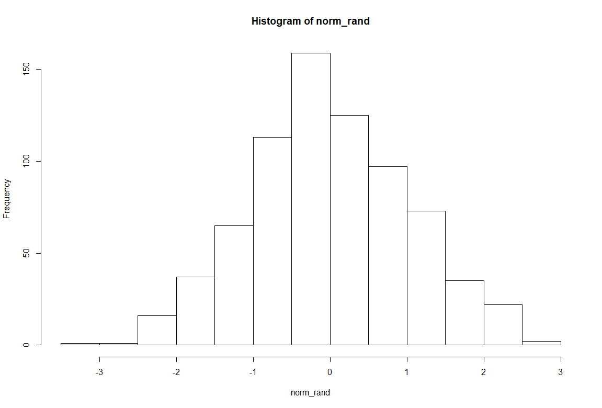
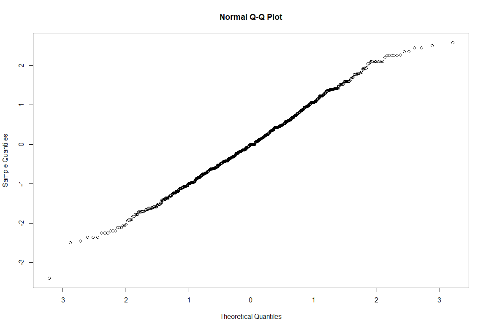
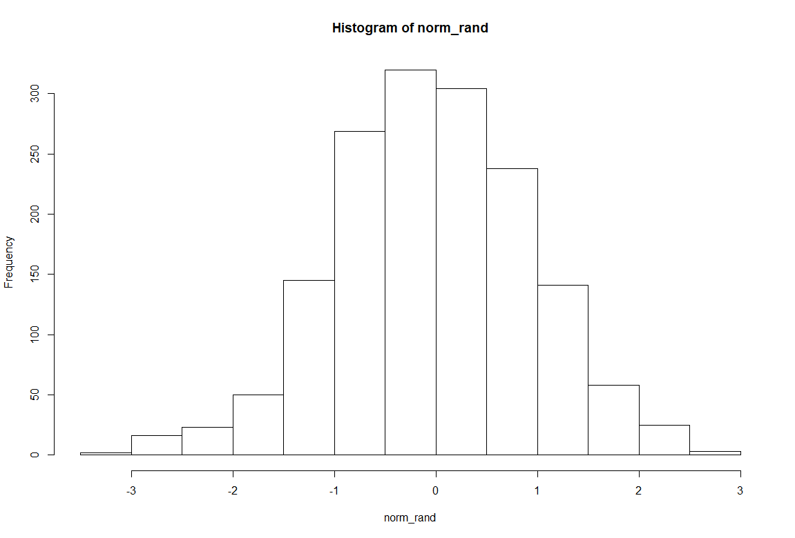
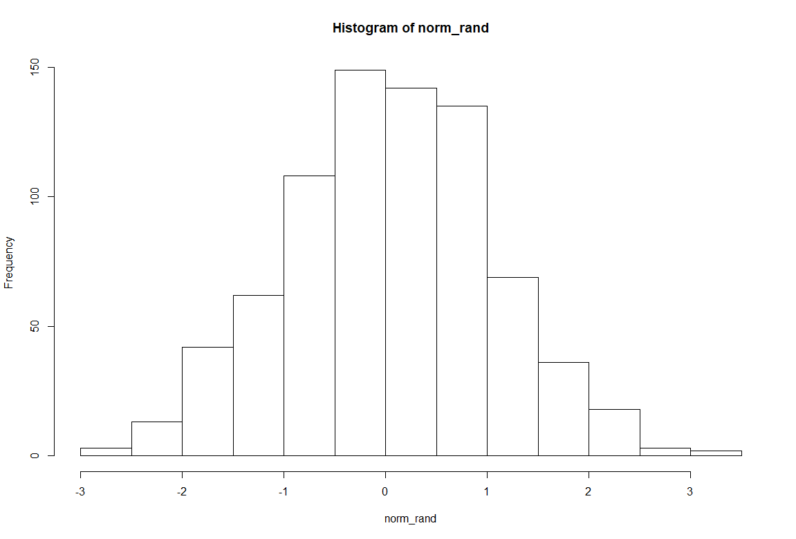
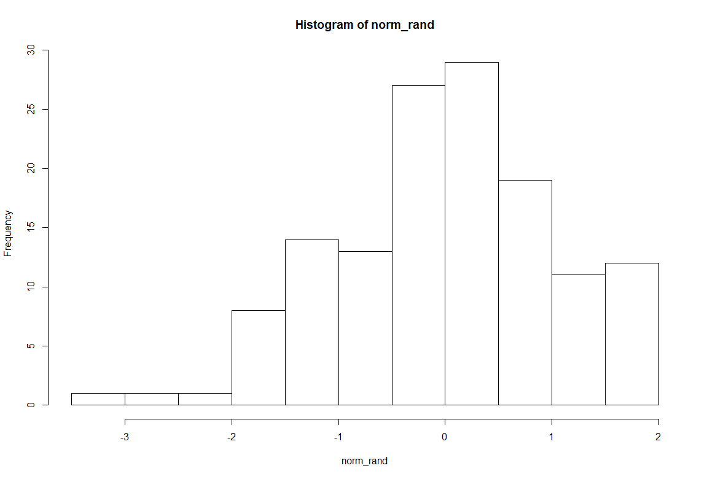

# Проверка случайности

используется реализация преобразования

https://ru.wikipedia.org/wiki/Преобразование_Бокса_—_Мюллера

https://rpubs.com/ForrestGam/117715

https://habrahabr.ru/post/208684/

## Внутренний рендом 0-37, 1000 значений

- [скрипт script.R](inner_random_37/script_solidity.R)

- [данные results](inner_random_37/results.txt)

### Shapiro-Wilk normality test > 0.05 Числа случайны

W = 0.99668, p-value = 0.1239

----------------------------------------------------------------------------------

## Внешний рендом на "движениях" мышки)

- [скрипт script.R](outer_random_js/script_js.R)

- [скрипт init.js](outer_random_js/init.js)

- [данные results](outer_random_js/results.csv)

### Shapiro-Wilk normality test > 0.05 Числа неслучайны

W = 0.9977, p-value = 0.02233

не предполагалось - но "сгенерированные" специальным пользователем движения мышки дают не случайное распределение (тк специально обученный пользователь двигал по шаблону всетаки пока смотрел сериальчик)

## Внешний рендом на window.crypto.getRandomValues

- [скрипт script.R](outer_random_js_outer/script_js_outer.R)

- [скрипт init.js](outer_random_js_outer/init.js)

- [данные results](outer_random_js_outer/results.csv)

### Shapiro-Wilk normality test > 0.05 Числа случайны

W = 0.99853, p-value = 0.7686

Второй по случайности алгоритм "криптографически" стойких случайных чисел в javascript

## Внешний рендом на server side random

- [скрипт script.R](outer_random_php/script_php.R)

- [скрипт any_data.php](outer_random_php/any_data.php)

- [данные results](outer_random_js_outer/results.csv)

### Shapiro-Wilk normality test > 0.05 Числа случайны

W = 0.98607, p-value = 0.1839

И для сравнения - третий алгоритм самой простой серверной части